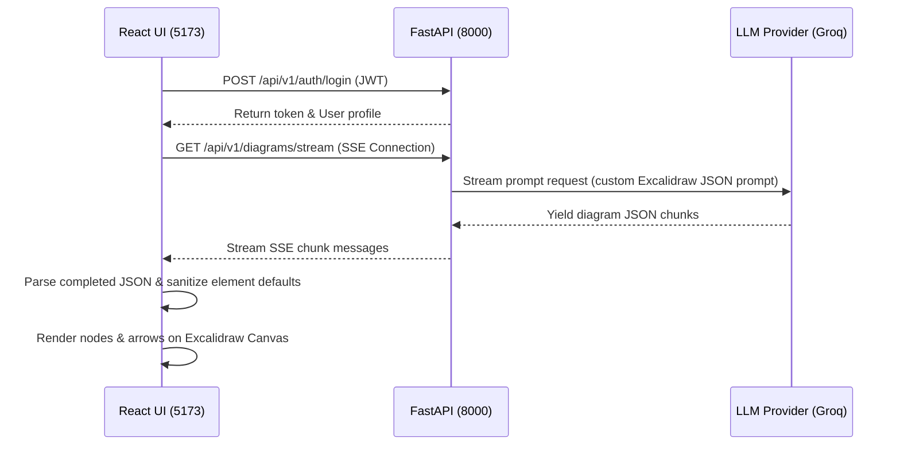

# ◇ AI Diagram Studio

> Convert plain text into beautiful, editable system architecture diagrams instantly using AI. Powered by FastAPI, React 19, and Excalidraw.

AI Diagram Studio allows developers, system architects, and designers to build premium system architecture diagrams from natural language prompts. Simply type your prompt (e.g., *"Create a system architecture diagram for an AI Diagram Studio app"*), click Generate, and watch the diagram stream onto the canvas in real-time.

---

## 🚀 Key Features

* **AI-Powered Prompt-to-Diagram**: Uses state-of-the-art LLMs (via Groq or OpenAI) to interpret text and output fully structured Excalidraw element schemas.
* **Real-time SSE Streaming**: Utilizes Server-Sent Events (SSE) to stream diagram generation chunk-by-chunk from the backend directly to the canvas.
* **Fully Editable Excalidraw Canvas**: Once generated, the diagram is loaded into a fully interactive Excalidraw canvas, allowing you to move boxes, resize shapes, write text, and customize layouts.
* **Premium Dark Theme**: Sleek, immersive UI styling matching modern design standards with glowing glassmorphism accents.
* **Persistent Sidebar History**: Securely keeps track of all past diagrams, saving them in real-time and allowing instant selection and loading without canvas rendering crashes.

---

## 🛠️ Tech Stack

### Frontend
* **Vite** + **React 19**
* **Excalidraw React Component**
* **Tailwind CSS v4** (selective utility classes to preserve Excalidraw canvas layout)
* **Axios** (REST API auth and interaction)

### Backend
* **FastAPI** (Python web framework)
* **Uvicorn** (ASGI server)
* **OpenAI / Groq API** (LLM Orchestration)
* **SQLAlchemy** + **PostgreSQL/SQLite** (Async database ORM)

---

## 📂 Project Structure

```text
├── backend/               # FastAPI backend service
│   ├── app/
│   │   ├── api/           # API endpoints (Auth, Diagrams, Streaming)
│   │   ├── core/          # App config and security helper settings
│   │   ├── db/            # Database session and models setup
│   │   └── service/       # LLM generation and prompts service
│   ├── .env.example       # Example env configuration
│   └── requirements.txt   # Python dependency list
│
└── frontend/              # Vite React frontend application
    ├── public/            # Static assets
    ├── src/
    │   ├── pages/         # Login, Register, and Generate views
    │   ├── App.jsx        # Routing definitions
    │   ├── index.css      # Core dark-theme design system and stylesheet
    │   └── main.jsx       # Entry point
    └── vite.config.js     # Dev proxy config (/api -> port 8000)
```

---

## ⚙️ Getting Started

Follow these steps to set up and run the application locally on your machine.

### Prerequisites
* **Node.js** (v18 or higher)
* **Python** (v3.10 or higher)
* **Groq API Key** (or OpenAI API Key)

---

### 1. Backend Setup

1. Navigate to the backend directory:
   ```bash
   cd backend
   ```

2. Create and activate a Python virtual environment:
   ```bash
   python -m venv .venv
   # On Windows:
   .venv\Scripts\activate
   # On macOS/Linux:
   source .venv/bin/activate
   ```

3. Install the required Python packages:
   ```bash
   pip install -r requirements.txt
   ```

4. Create a `.env` file from the example template:
   ```bash
   cp .env.example .env
   ```

5. Open `.env` and fill in your values:
   ```env
   ENVIRONMENT=development
   LLM_PROVIDER=groq
   GROQ_API_KEY=your_groq_api_key_here
   GROQ_MODEL=llama-3.3-70b-versatile
   DATABASE_URL=sqlite+aiosqlite:///./sql_app.db
   ```

6. Start the FastAPI development server:
   ```bash
   uvicorn app.main:app --reload --port 8000
   ```
   The backend API will run on `http://localhost:8000`.

---

### 2. Frontend Setup

1. Navigate to the frontend directory:
   ```bash
   cd ../frontend
   ```

2. Install the frontend dependencies:
   ```bash
   npm install
   ```

3. Start the Vite dev server:
   ```bash
   npm run dev
   ```
   The Vite app will open at `http://localhost:5173`.

---

## 📡 Architecture Workflow



---

## 🛡️ License

Distributed under the MIT License. See `LICENSE` for more information.
